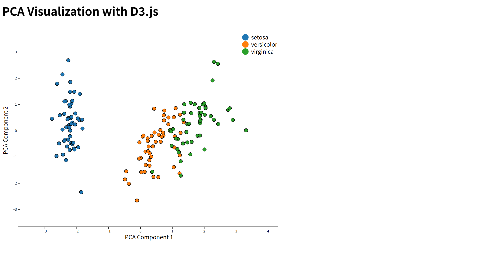

## Iris 데이터셋을 활용한 머신러닝 API 구현 프로젝트

## Iris 데이터셋이란?
- 붓꽃의 4가지 특성을 기반으로 세 가지 붓꽃 (Setosa, Versicolor, Virginica)을 분류하는 문제를 다룬다.
- Iris dataset 구성:
    - 데이터 수: 총 150개의 샘플
    - Class 수: 3개의 붓꽃 품종
    - 특징:  

        | 특징            | 데이터 형식   | 설명                                 |
        |-----------------|---------------|--------------------------------------|
        | Sepal Length    | float         | 꽃받침 길이 (cm)                    |
        | Sepal Width     | float         | 꽃받침 너비 (cm)                    |
        | Petal Length    | float         | 꽃잎 길이 (cm)                      |
        | Petal Width     | float         | 꽃잎 너비 (cm)                      |
        | Class (target)  | categorical   | 품종 (Setosa, Versicolor, Virginica) |

## PCA란?
- PCA (Principle Component Analysis): 주성분 분석
- 대표적인 비지도 학습 모델
- 고차원 데이터를 저차원으로 변환해 중요한 정보를 요약하는 차원 축소 기법
- 차원 축소 (Dimension Reduction)
    - 데이터의 차원(특성의 수)을 줄여 데이터의 중요한 정보를 최대한 보존하는 것이 목적
- 데이터의 주요 패턴을 캡처하면서 차원을 줄이는 분석 기법
- 데이터의 분산을 최대화 하는 주성분을 찾는 것
    - ex. 데이터들을 정사영 시켜 차원을 낮춘다면 과연 어떤 벡터에 데이터들을 정사영 시켜야 원래의 데이터 구조를 제일 잘 유지할 수 있을까?

## PCA 변환 과정 설명
```bash
iris.ipynb 에서 확인 할 수 있습니다.
```

## 실행 방법
1. 가상환경 생성
    ```bash
    python -m venv venv
    ```
2. 가상환경 활성화
    ```bash
    venv\Scripts\activate
    ```
3. 의존성 설치
    ```bash
    pip install -r requirements.txt
    ```
4. 웹 시스템 실행
    ```bash
    python app.py
    ```
브라우저에서 http://localhost:5000으로 접속하여 시스템을 확인할 수 있다.

## 프로젝트 구조
```bash
Project
    ├── static/js                      
    │   └── pca.js          # D3.js를 이용하여 PCA 데이터를 시각화하는 JavaScript 파일  
    │  
    ├── templates
    │   └── index.html      # Flask에서 렌더링되는 웹 페이지 (D3.js를 포함)  
    │   
    ├── app.py              # Flask 애플리케이션 서버, PCA 데이터 처리 및 API 제공  
    ├── iris.ipynb          # Jupyter Notebook, 데이터 분석 및 PCA 적용 과정 기록  
    ├── README.md           # 프로젝트 개요 및 사용법 설명 
    └── requirements.txt    # 프로젝트의 필수 패키지 목록 (Flask, pandas, sklearn 등) 
```

## 결과
